# Distributed Programming I

## Web Programming Test Assignment A.Y. 2018/2019

Build asimplified version of a website to manage seat reservations for an airplane. For simplicity, consider reservations for one plane and one journey only. Consider a cabin with seats arranged according to a rectangular layout of known size: `6 seats in width x 10 places in length`. These values must be easily adjustableby setting two variables in a single position in the PHP code. The seats in a row are indicated with a letter starting from `A`, the rows with a number starting from `1`.

### The website must have the following characteristics

#### Homepage

The general layout of the web pages must contain:

- a header at the top
- a navigation bar on the left side
- a central part which is used for the main operations

In the central part of the **homepage**, anyone can view the seat map status:

- the `purchased` seats are displayed in **red**
- the `free` ones in **green**
- those `reserved` for purchase by any user in **orange**

The page must also display the total number of seats, the total number of those purchased, those reserved, and the free ones.

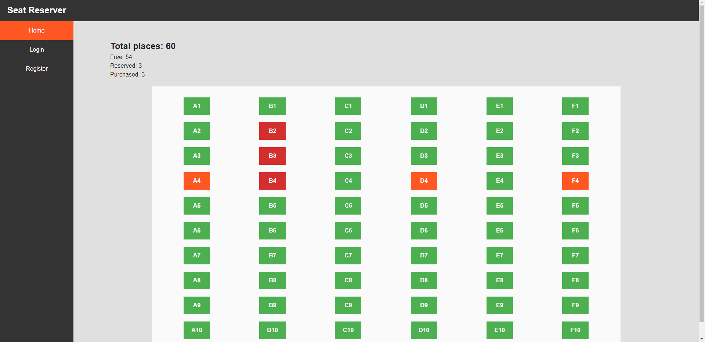

#### Authentication

The reservation and purchase of seats is possible only after registration and authentication on the site. Each user can freely **register** by providing:

- a valid email address
- a password, which must contain at least one lowercase character, and at least one uppercase character or a number

otherwise the user must be **warned before sending anything to the server**, and the registration must be prevented.

If the registration succeeds, the user results authenticated to the system.

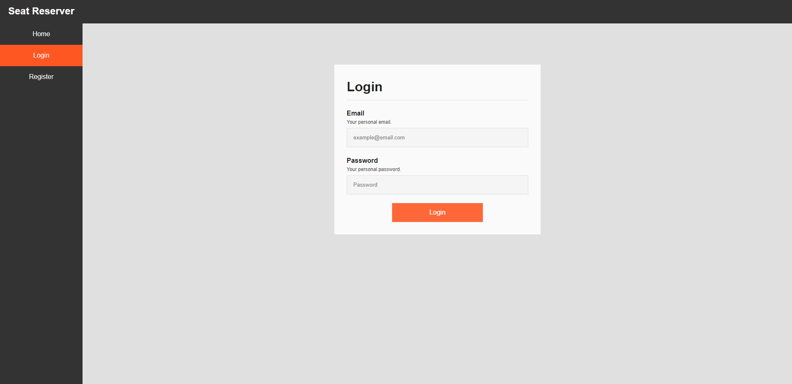
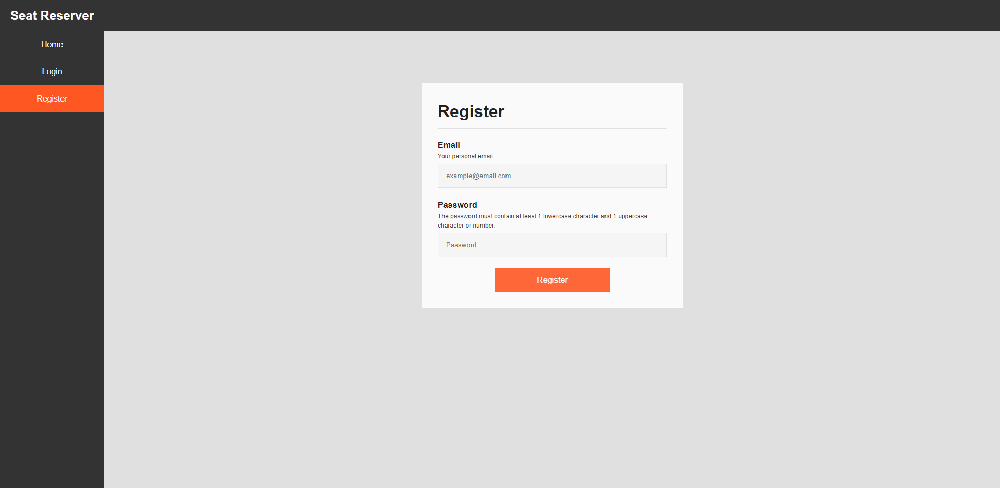

Authentication remains valid until the user has periods of **inactivity exceeding 2 minutes**. If  a user tries to perform an operation that requires to be authenticated, after the timeout is expired, the operation must be prevented and the user must be forced to login again.

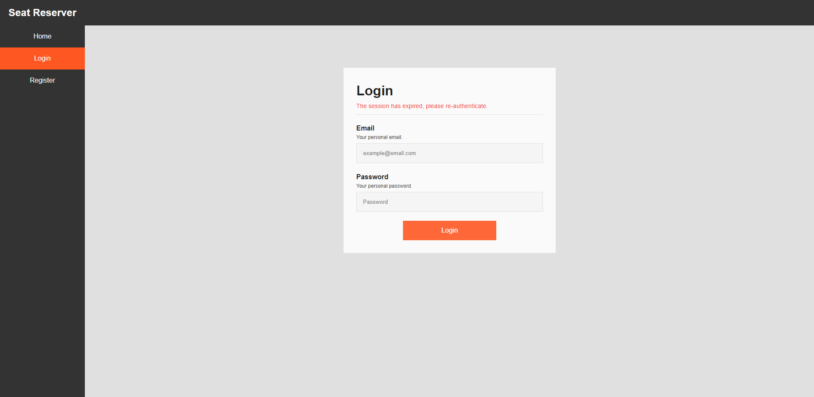

Every request that contains sensitive data **must use the HTTPS protocol**.

#### Reservation of seats

An authenticated user can **reserve** seats. In order to do it, the user must click on the seat he wants to reserve, which can be free or reserved by another user. **Without reloading the page**, the server must check that the seat was not purchased in the meantime. If it was not, the seat is displayed as `reserved` (in **yellow** because the reservation now belongs to the authenticated user) and the reservation is stored in the server. Otherwise, the seat must be displayed in **red**, and obviously it must not be selectable anymore. If the seat was previously reserved by another user, that reservation must be removed.

In any case, with a click on a seat, a **message** indicating what happened must be displayed, and the seat color must be updated according to its new status.

If a user clicks on one of **his reseved seats**, without reloading the page, the reservaton must be **cancelled** and the seat becomes `free`.

#### Update seat map

The seat map can be completely **updated** clicking an `Update` button, which can be used only by authenticated users.

#### Purchase of seats

When the user has reserved at least one seat, he can click the `Buy` button to **purchase** them. The purchase request refers only to those seats that are displayed in yellow to the user at the moment he presses the button. If  the operation is **not possible** in its entirety (i.e. some seats have been purchased or reserved by other users), all the reserved seats must be **released**.

In any case, the page must be **reloaded**, showing the new status of all the seats, and a **message** must informthe user about what happened, including the reason for a failure of the operation.

#### Functionalities

**Cookies** and **Javascript** must be enabled, otherwise the website must not work.

## Example and images of my implementation

Initially all seats are free.

User `U1` **reserve** `A1`, `A2` and `B2`, which become all yellow.

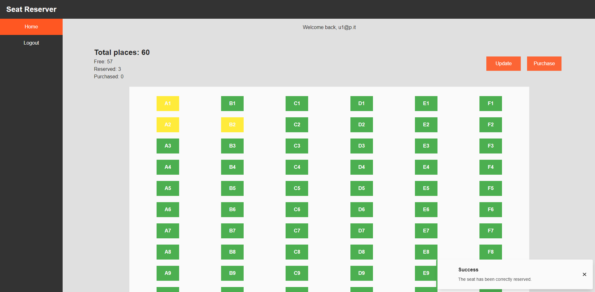

User `U2`, that still sees all the seats as free, **reserves** `B2`, which becomes yellow. Seat `B2` is now reserved by `U2` and `U1` is unaware of this.

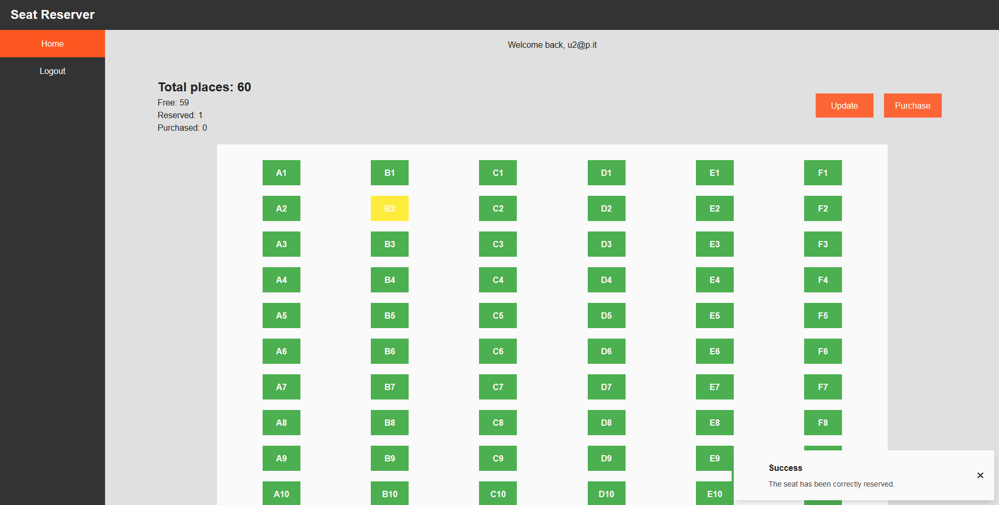

User `U1` tries to **buy** his reserved seats, but the operation fails because `B2` has been reserved in the meantime. So, the reservation for `A1` and `A2` is cancelled, and the seat map status of `U1` is updated (only `B2` in orange).

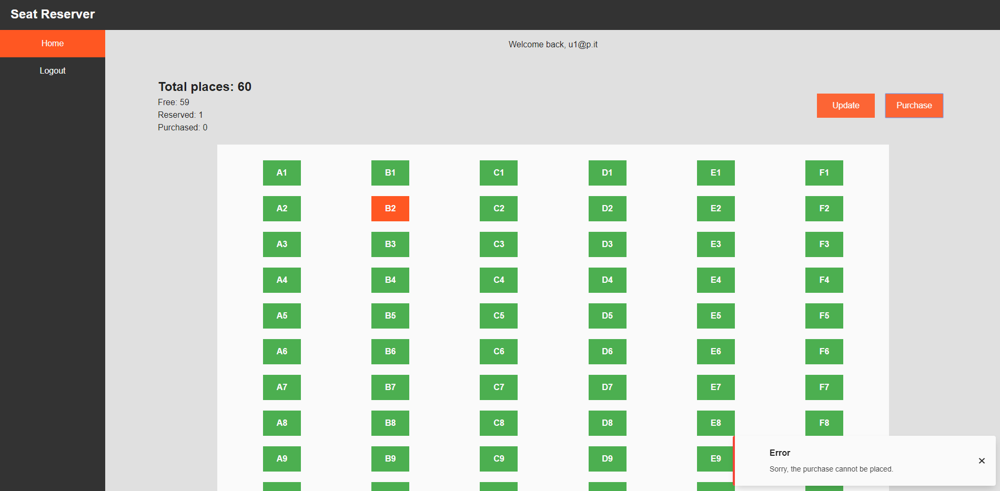

User `U2` **reserves** `B3` and `B4`, and proceeds with the **purchase**. The operation succeeds and `B2`, `B3` and `B4` become purchased (displayed in red to `U2`).

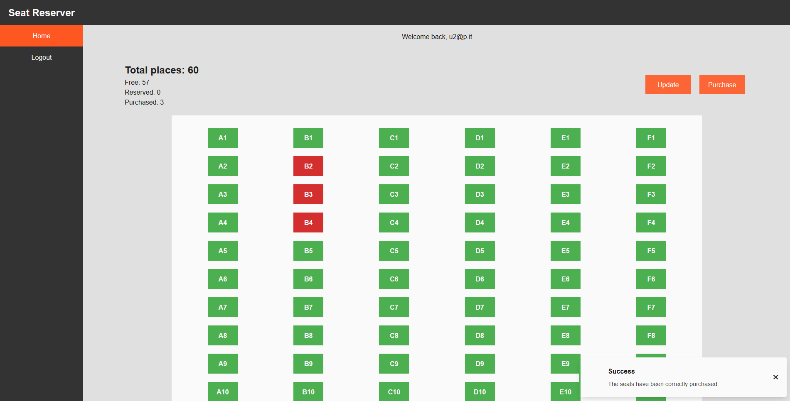

User `U1` tries to **reserve** `B4`: the operation fails because `B4` has been purchased in the meantime.

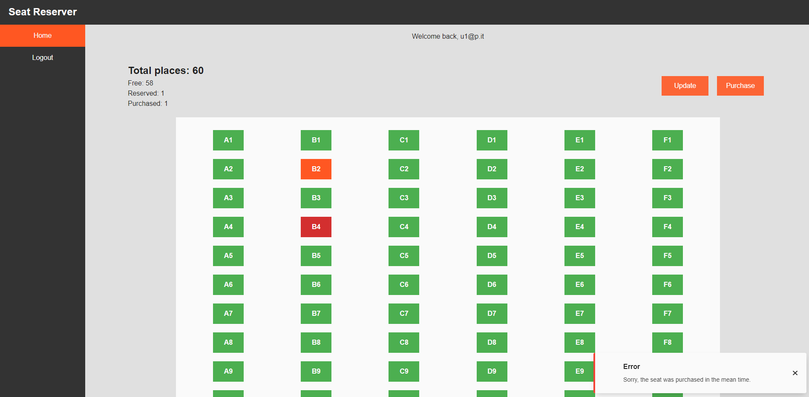

User `U1` **reserves** `A4`, `D4` and `F4`, which become all yellow in the user’s view.

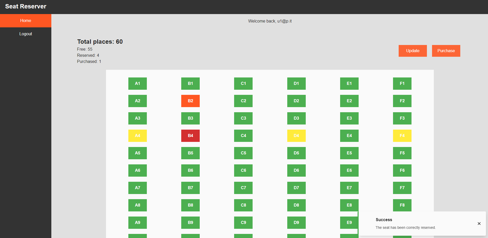

User `U2` **reserves** `F4`, which becomes yellow in the user’s view.

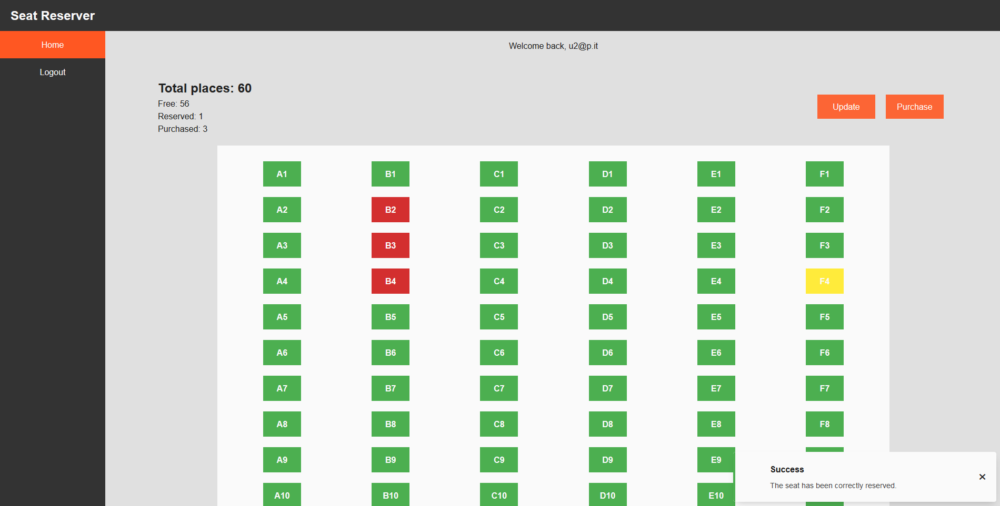

User `U1` **updates** the seat map: `F4` has turned orange.

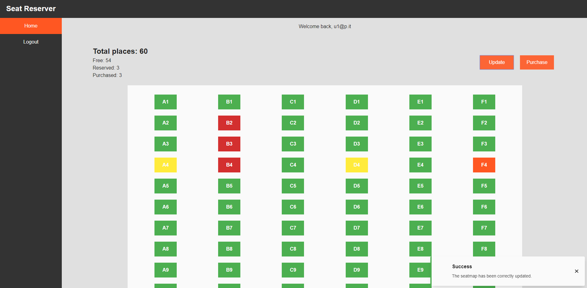
