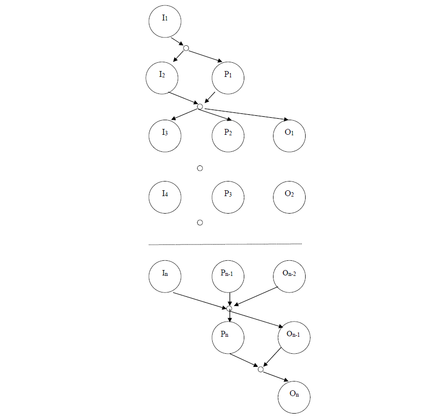

# Instructions

## Exercise 01

Implement a C program that:

- takes from the command line two integer numbers ```n1``` ```n2```
- allocates two vectors ```v1``` and ```v2```, of dimensions ```n1``` and ```n2```
- fills ```v1``` with ```n1``` random **even** integer numbers between ```10-100```
- fills ```v2``` with ```n2``` random **odd** integer numbers between ```21-101```
- sort ```v1``` and ```v2``` in ascending order
- save the content of vectors ```v1``` and ```v2``` in two text files ```fv1.txt``` and ```fv2.txt```
- save the content of vectors ```v1``` and ```v2``` in two binary files ```fv1.b``` and ```fv2.b```

Use command ```od``` for verifying the content of files ```fv1.b``` and ```fv2.b```.

## Exercise 02

Implement a concurrent C program that performs the same task of [exercise 01](#exercise-01), but with concurrency.
The main process, creates two children, and waits their termination, collecting their exit
status. Each child creates a file with filename, ```v1``` or ```v2```, corresponding to its identity, and returns its identity, ```1``` or ```2```.

## Exercise 03

Write a concurrent C program, using Pthreads, which takes a filename as an
argument in the command line, and implements the precedence graph drawn below.



It represents the sequence of operations that a main thread performs for processing the content of a text file. Each node of the graph represents a thread. All threads are created by the main thread. There are three types of threads:

- the ```Input``` thread, which gets the next character from the file
- the ```Processing``` thread, which transforms to upper case the character
- the ```Output``` thread, which prints the the character