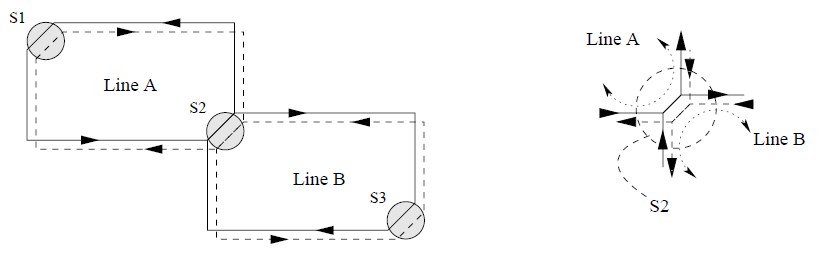

# Instructions

## Exercise 01

A small underground network has the following schematic representation:



where ```Line A``` and ```Line B``` indicate the two underground lines (each one with two directions, clockwise and anti-clockwise), and ```S1```, ```S2```, and ```S3``` are the three stations. Notice that in station ```S2``` tracks are **common**, in both directions, for ```Line A``` and ```Line B```.

To control the underground network, write a Windows-32 application with the following specifications:

- At the start-up the application must create:
  - One thread named ```commuters``` in charge of the commuters entering all underground stations. This thread, every *Time1* seconds decides the number of commuters (in the range ```[0, 100]```) entering each station in each direction.
  - One thread for each station, named ```station```. Stations are initially empty, but a random number of commuters enter each stations as specified by the thread ```commuters```.

- When:
  - The number of commuters has been greater than 75 for a direction for 3 consecutive times (i.e., at ```T```, ```T + Time1``` and ```T + 2 x Time1``` for any time ```T```) the station must generate a new train in that direction.  
  - The number of commuters has been less than 30 for a direction for 3 consecutive times (i.e., at ```T``` , ```T + Time1``` and ```T + 2 x Time1``` for any time ```T```) the station must suppress the first train it has created.

- Each train is represented by a thread ```train``` and it has a capacity of 100 passengers. Each train needs *Time2* seconds to move from one station to the following one, and it enters a station only if the tracks are empty in its direction. Each train stays in the station *Time3* seconds. Every time a train enters a station, a random number of passengers leave the train, and a random number of passengers get on board of the train. When a train is killed (by one station) it is suppose to end its run in a secondary station (not taken in charge by the system) where all commuters on-board get out.

The application has to simulate the entire underground network, printing all main actions performed by the commuters, all station and all train threads. The following is a possible example of simulation:

    commuterThread station=S1 direction=clockwise commutersIn=65
    commuterThread station=S2 direction=anticlockwise commutersIn=25
    commuterThread station=S3 direction=clockwise commutersIn=30
    commuterThread station=S1 direction=clockwise commutersIn=25
    stationThread=S1 direction=clockwise train-Create=T1
    trainThread=T1
    commutersIn=63
    trainThread=T1
    stationIn=S2
    trainThread=T1
    commutersOut=45
    trainThread=T1
    commuterIn=27
    trainThread=T1
    stationOut=S2
    commuterThread station=S2 direction=anticlockwise commutersIn=60
    stationThread=S2 direction=anticlockwise train-Create=T2
